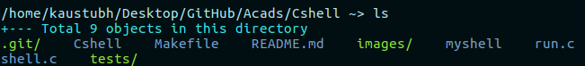
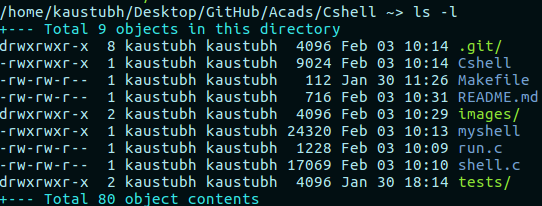
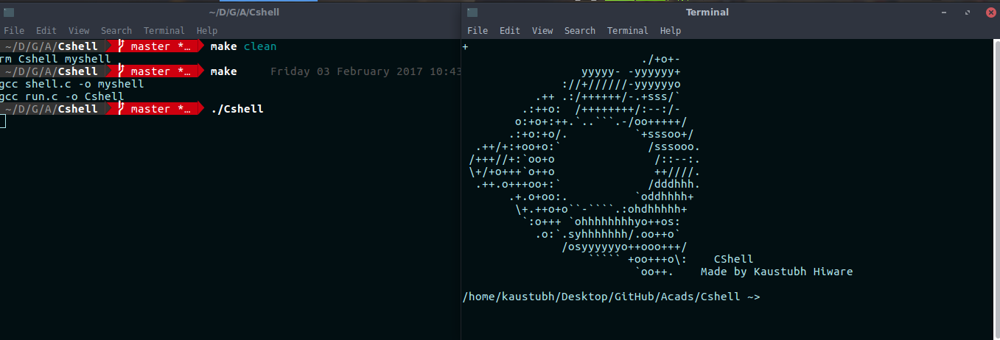

# Cshell

A shell implemented in C. Written as a part of Operating Systems (CS39002) coursework.

## Functionalities

 The following functions have been written explicitly in C.

* **cd**  - Change directory

* **pwd** - Present Working directory

* **mkdir <dir>** - Make a directory (Alerts if already exists)

* **rmdir <dir>** - Remove the directory (Alerts if no such file or directory)

* **ls** - List contents of pwd

 

* **ls -l** - List the contents in long listing format

 

* **cp <file1> <file2>** - Copy contents of file1 to file2; only if file1 was more recently modified. Create file2 if not present already.

* **exit** - Exit the shell ; also works for **z**

* Supports running the **execuables** (predominanatly, ./a.out and scripting commands, like touch, cat, python notif.py )

 * Any path added to your `$PATH` folder will work. [Refer to function runprocess in shell.c]

 * Support background execution such as `python notif.py &`  - returns its PID.

 * Input from and output to files, such as `./d < in.txt` and `./inc > in.txt` supported. (Both can work simultaneously.)

 * Support piping upto 2 levels - such as `./inc | ./d` and `./inc | ./d | ./t `

## Execution

<pre style="background: rgb(238, 238, 238); border: 1px solid rgb(204, 204, 204); padding: 5px 10px;">make clean
make
./Cshell</pre>

Output :

The test cases are present in [tests](tests/) folder.

`run.c` creates a child process to execute `shell.c` in a gnome-terminal, suited for debuggging. In case the terminal session is to be viewed in the continuing session, execution is as :

<pre style="background: rgb(238, 238, 238); border: 1px solid rgb(204, 204, 204); padding: 5px 10px;">make clean
make
./myshell</pre>

## Known issues

* `gcc` and `grep` don't work for some freaking reason. Most of the other commands like cat, touc, gedit, atom work but these 2 seem to hold a grudge against me.

* support piping with system calls.
